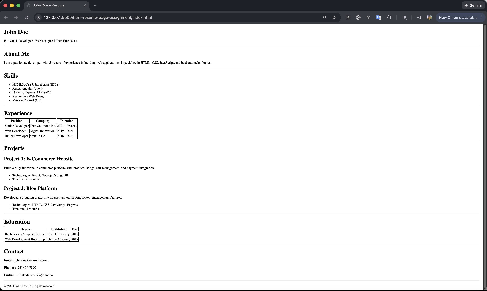

# HTML Resume Page Assignment

This project is a simple HTML and CSS-based resume page. It demonstrates basic web development skills using only HTML and CSS.

## Setup Steps

1. **Clone or Download the Repository**
   - Clone this repository to your local machine using:
     ```sh
     git clone <repository-url>
     ```
   - Or download the ZIP and extract it.

2. **Navigate to the Project Directory**
   - Open a terminal and change to the project folder:
     ```sh
     cd html-resume-page-assignment
     ```

3. **Open the Project in a Browser**
   - Open `index.html` in your preferred web browser. You can double-click the file or use:
     ```sh
     open index.html
     ```

## Usage

- Edit `index.html` to update your resume content.
- Modify `site.css` to change the styling as desired.
- View the page in your browser to see your changes live.
- You can use Live Server (Ritwick Dey) to view your changes automatically without manual refresh.

## Screenshots of current implementation



---

Feel free to customize this README and the project files to better fit your needs!
